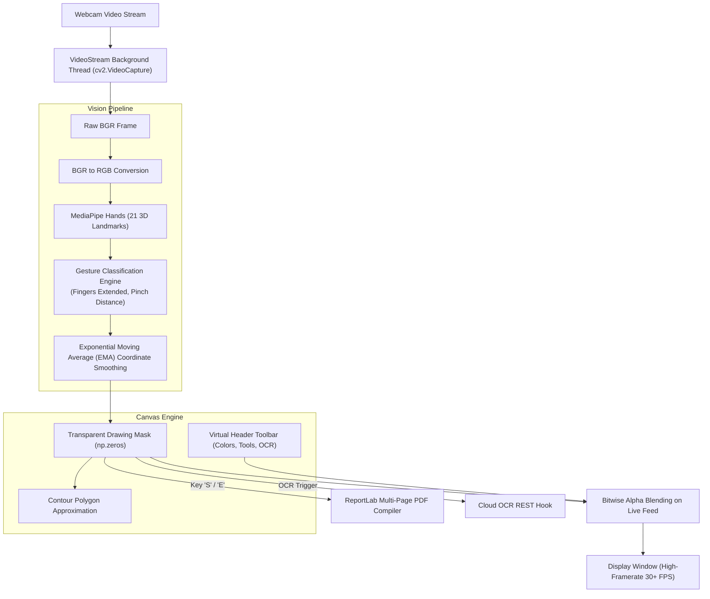

# Air Whiteboard Pro

A real-time touchless virtual drawing canvas powered by MediaPipe hand tracking, OpenCV computer vision, EMA trajectory smoothing, and multi-page PDF export.


---

## Overview

Air Whiteboard Pro transforms a standard computer webcam into an interactive touchless digital drawing surface. Using real-time computer vision and machine learning, the application tracks 21 three-dimensional hand landmarks without requiring specialized wearable sensors or depth cameras. An Exponential Moving Average (EMA) coordinate filter eliminates hand jitter to produce clean digital strokes, while dynamic pinch distance controls brush diameter on the fly. Users interact with virtual onscreen toolbars to switch colors, toggle eraser modes, snap hand-drawn strokes into clean geometric shapes (rectangles, triangles, circles), and compile multi-page drawing sessions into publication-ready PDF documents.

---

## Features

- **21-Landmark Hand Tracking:** Powered by MediaPipe Hands (`min_detection_confidence=0.7`, `min_tracking_confidence=0.7`) for robust single-hand keypoint localization.
- **Multithreaded Video Capture:** Dedicated background daemon thread (`VideoStream`) decouples webcam I/O from frame processing to maintain stable 30+ FPS execution.
- **Jitter-Free Stroke Smoothing:** Exponential Moving Average (EMA) filtering buffers fingertip coordinates to render smooth lines without erratic stair-stepping.
- **Dynamic Pinch-to-Size Control:** Measures Euclidean distance between thumb and index fingertips to scale brush thickness dynamically.
- **Touchless Virtual UI Toolbar:** Interactive header overlays enable in-air button selection for color palettes (Blue, Green, Red, Yellow), brush sizes, eraser, and clear screen.
- **Geometric Shape Recognition:** Contour analysis snaps rough hand-drawn loops and polygons into perfect geometric primitives (rectangles, circles, triangles, lines).
- **Multi-Page Session Export:** Compiles buffered whiteboard pages into a formatted multi-page PDF using ReportLab.
- **OCR Handwriting Integration:** Background worker hook captures selected drawing regions and transmits them to an OCR endpoint for text transcription.

---

## Architecture & Vision Pipeline



---

## Gesture Controls Reference

| Gesture | Finger State | Action |
|---|---|---|
| **Draw** | Only Index Finger Raised | Paints freehand strokes on canvas |
| **Select / Hover** | Index + Middle Fingers Raised | Moves cursor without drawing; clicks virtual UI buttons |
| **Resize Brush** | Thumb & Index Pinching | Scales brush radius proportionally with distance |
| **Erase** | All Fingers Extended (Open Palm) | Activates eraser block to wipe strokes |
| **Pause** | Fist Closed | Freezes canvas state |

### Keyboard Shortcuts
- `C` — Clear entire canvas
- `S` — Save current canvas state to page buffer
- `E` — Export all buffered pages to PDF document
- `R` — Snap rough strokes into geometric shapes
- `Q` — Cleanly exit application

---

## Hardware Requirements

| Component | Minimum Specification | Recommended |
|---|---|---|
| **Webcam** | 720p @ 30 FPS USB Camera | 1080p Integrated or USB Camera |
| **Lighting** | Standard ambient indoor lighting | Even lighting with non-cluttered background |
| **Processor** | Dual-core x86_64 / Apple Silicon | Quad-core CPU with AVX support |
| **RAM** | 4 GB | 8 GB |

---

## Software & Dependencies

- **Programming Language:** Python 3.10+
- **Core Libraries:**
  - `opencv-python` (`cv2`) — Frame capture, drawing primitives, and UI rendering
  - `mediapipe` — Real-time hand landmark estimation
  - `numpy` — Array masks and alpha blending math
  - `reportlab` — PDF generation and page rendering
  - `requests` — HTTP communication with OCR server

---

## Project Structure

```
Air-Whiteboard-Pro/
├── air_draw.py             # Primary application and vision pipeline
├── tests/                   # Unit tests and OCR endpoint validation\n│   ├── test_ocr.py\n│   └── test_whiteboard.py\n├── docs/                    # Gesture specs and technical documentation
├── requirements.txt        # Python dependency manifest
├── .gitignore              # Git ignore exclusions
└── README.md               # Technical architecture documentation
```

---

## Setup and Usage

### 1. Clone Repository & Install Dependencies
```bash
git clone https://github.com/saptarshidas578/Air-Whiteboard-Pro.git
cd Air-Whiteboard-Pro

# Create and activate virtual environment
python -m venv venv
# Windows:
venv\Scripts\activate
# Linux/macOS:
source venv/bin/activate

# Install dependencies
pip install -r requirements.txt
```

### 2. Run Application
```bash
python air_draw.py
```
- Stand 1.5 to 3 feet in front of your webcam in good lighting.
- Raise your index finger to begin drawing in the air.
- Raise both index and middle fingers to reach up and click virtual buttons on the top bar.

---

## Future Work

- [ ] Palm rejection algorithm to prevent accidental marks while resting hand.
- [ ] Two-handed gesture controls (e.g. two-finger pinch-to-zoom and canvas panning).
- [ ] Direct export to vector SVG paths in addition to raster PDF pages.

---

## Author & Contact

- **Author:** [saptarshi2007 (saptarshidas578)](https://github.com/saptarshidas578)
- **Institution:** B.Tech Electrical & Computer Science Engineering, VIT Vellore
- **LinkedIn:** TODO(author): add link

---

## License

Recommended: [MIT License](https://opensource.org/licenses/MIT).  
*TODO(author): confirm license selection.*
